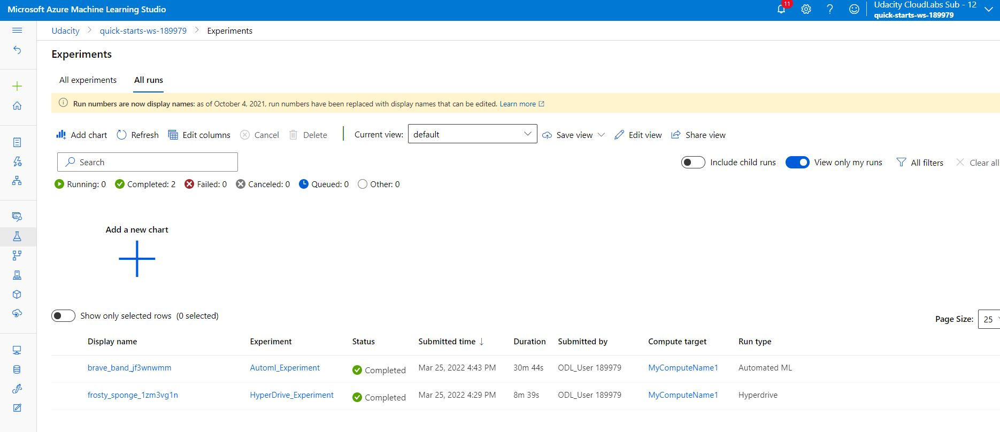

# Optimizing an ML Pipeline in Azure

## Overview
This project is part of the Udacity Azure ML Nanodegree.
In this project, we build and optimize an Azure ML pipeline using the Python SDK and a provided Scikit-learn model.
This model is then compared to an Azure AutoML run.

## Useful Resources
- [ScriptRunConfig Class](https://docs.microsoft.com/en-us/python/api/azureml-core/azureml.core.scriptrunconfig?view=azure-ml-py)
- [Configure and submit training runs](https://docs.microsoft.com/en-us/azure/machine-learning/how-to-set-up-training-targets)
- [HyperDriveConfig Class](https://docs.microsoft.com/en-us/python/api/azureml-train-core/azureml.train.hyperdrive.hyperdriveconfig?view=azure-ml-py)
- [How to tune hyperparamters](https://docs.microsoft.com/en-us/azure/machine-learning/how-to-tune-hyperparameters)

## Summary
**In 1-2 sentences, explain the problem statement: e.g "This dataset contains data about... we seek to predict..."**

**In 1-2 sentences, explain the solution: e.g. "The best performing model was a ..."**

## Scikit-learn Pipeline
**Explain the pipeline architecture, including data, hyperparameter tuning, and classification algorithm.**

**What are the benefits of the parameter sampler you chose?**

**What are the benefits of the early stopping policy you chose?**

## AutoML
**In 1-2 sentences, describe the model and hyperparameters generated by AutoML.**

## Pipeline comparison
**Compare the two models and their performance. What are the differences in accuracy? In architecture? If there was a difference, why do you think there was one?**

## Future work

- In HyperDrive, we have used only two parameters of 'LogisticRegression' model : (C, max_iter). For future experiments, areas of improvement can be to use other parameters like : (penalty, dual, tol, fit_intercept, intercept_scaling, class_weight, solver, multi_class, warm_start, l1_ratio). May be these improvements might help in increasing the model performance. 

- In HyperDrive, we have used model 'LogisticRegression'. For future experiments, areas of improvement can be to use other models. May be these improvements might help in increasing the performance.

- In AutoML, we have used number of cross validations : 3. For future experiments, areas of improvement can be to change number of cross validations and may be also change other automl settings. May be these improvements might help in increasing the model performance. 

## Proof of cluster clean up
 
- Image of cluster marked for deletion

