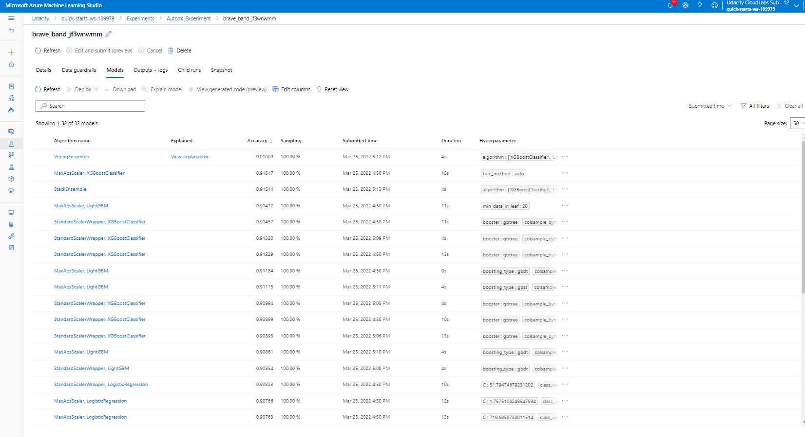
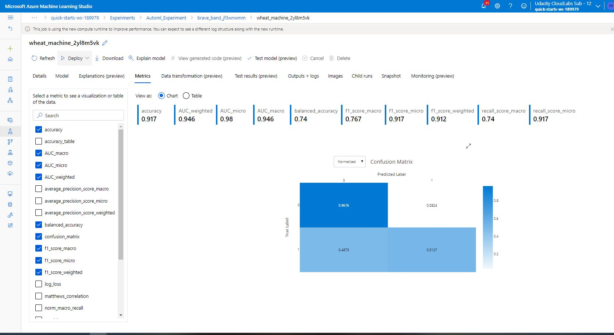
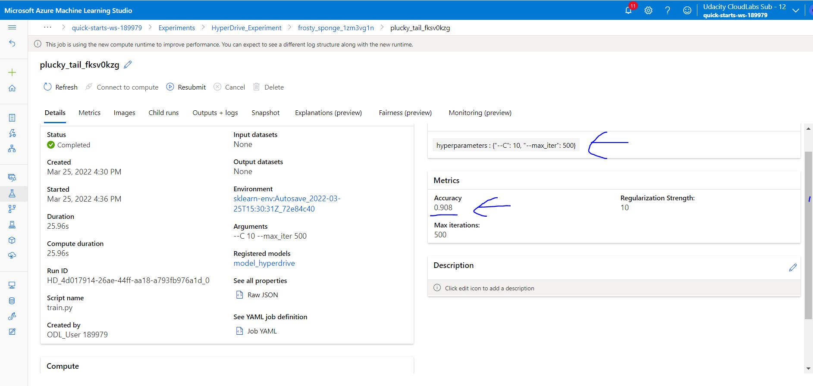
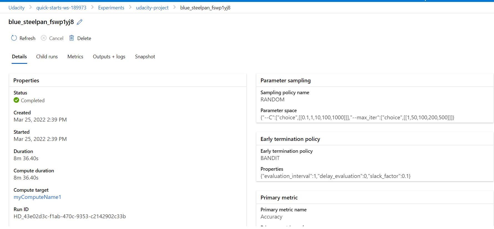
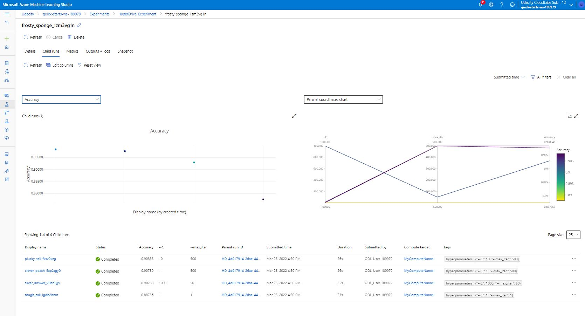
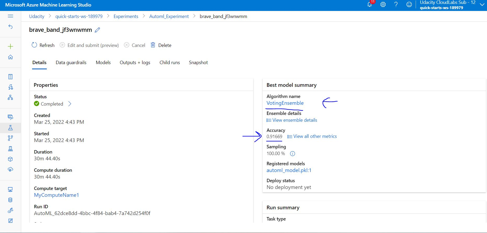
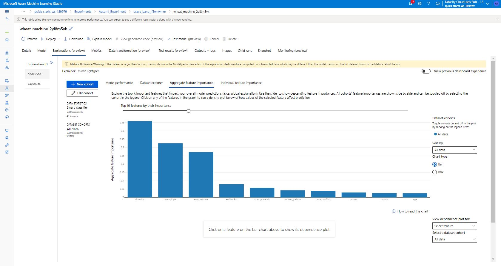
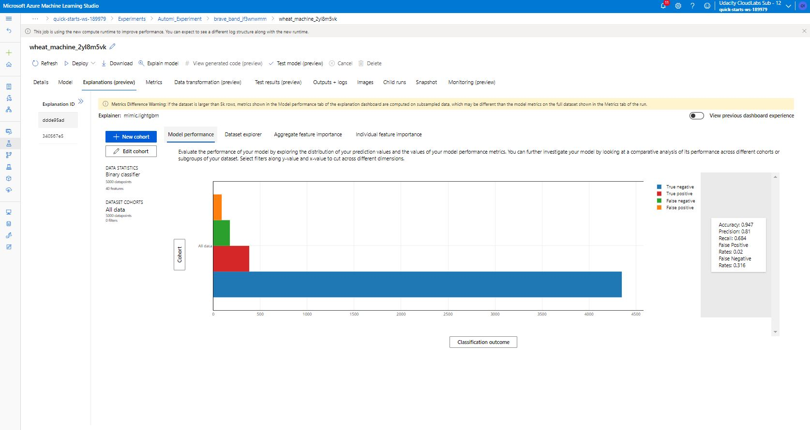
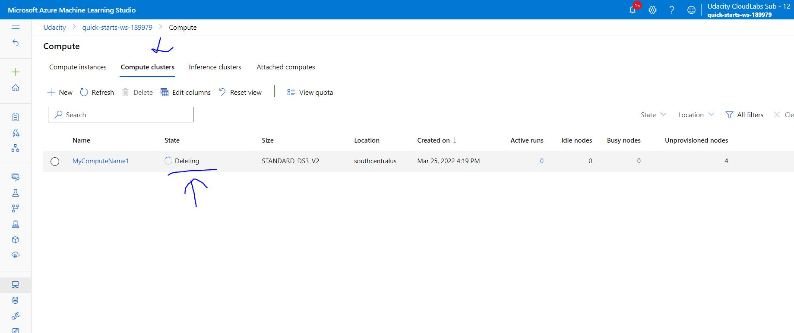

# Optimizing an ML Pipeline in Azure

## Overview

This project is part of the Udacity Azure ML Nanodegree.
In this project, we build and optimize an Azure ML pipeline using the Python SDK and a provided Scikit-learn model.
Hyperparameters of Scikit-learn model is tuned by using Azure Machine Learning HyperDrive package.
This model is then compared to an Azure AutoML run.

## Summary

- This dataset contains data about a bank's customers. It contains information like age, job, education, loan, contact, etc.
- We seek to predict that if a customer is interested to subscribe for the bank term deposit scheme.
- The best performing model was a 'Voting ensemble' with accuracy of 0.92 which was achieved using Automated machine learning (AutoML).

## Scikit-learn Pipeline

### Pipeline architecture

- Data was fetched from a url using TabularDatasetFactory class which create a tabular dataset for Azure Machine Learning.
- Data was cleaned and One hot encoding was done (converting categorical data variables so they can be provided to machine learning algorithms to improve predictions).
- Data was splitted into train and test subsets with ratio 80/20 (train/test).
- Data was passed to Logistic Regression classifier for training on train dataset and predicting on test dataset. Hyperparameters (control the model training process) are defined. Model performance depends heavily on hyperparameters.
- Hyperparameters used are C (inverse regularization) and max_iter (maximum number of iterations).
- Automate efficient hyperparameter tuning by using Azure Machine Learning HyperDrive package. Hyperparameter tuning (hyperparameter optimization) was done to find the configuration of hyperparameters that results in the best performance.

Hyperparameter tuning includes following steps :
- Parameter search space is defined using 'Random sampling'.
- Primary metric 'Accuracy' is specified to optimize.
- Early termination policy 'Bandit policy' is specified for low-performing runs.
- Creating and assigning resources.
- Launching an experiment with the defined configuration.
- Visualizing the training runs.
- Selecting the best configuration for model.

### Benefits of the parameter sampler - Random sampling

- It supports discrete and continuous hyperparameters.
- It supports early termination of low-performance runs.
- Hyperparameter values are randomly selected from the defined search space.

### Benefits of the early stopping policy - Bandit policy

- Automatically end poorly performing runs with an early termination policy. Early termination improves computational efficiency.
- It is based on slack factor and evaluation interval. It ends runs when the primary metric isn't within the specified slack factor of the most successful run.

## AutoML

### Model and hyperparameters generated

AutoMLConfig represents configuration for submitting an automated ML experiment in Azure Machine Learning. This configuration object contains and persists the parameters for configuring the experiment run, as well as the training data to be used at run time. We have used following parameters :

   - task : task needs to be performed - classification.
   - primary_metric : the evaluation metric for the models - accuracy.
   - experiment_timeout_minutes : the time after which autoML will stop - 30 minutes.
   - training_data : the data on which we need to do training.
   - label_column_name : the column name in the training data which is the output label.
   - n_cross_validations : n-fold cross validations needed to perform in each model - 3.

It contains following steps :

- Features Generation : generating features for the dataset.
- Dataset Featurization : beginning to fit featurizers and featurize the dataset.
- Dataset Balancing : performing class balancing sweeping.
- Dataset Cross Validation Split : generating individually featurized CV splits.
- Model Selection : beginning model selection.
- 32 different models have been used.
- Class balancing detection : imbalanced data.
- Hyperparameters tuning is done automatically.

Image of AutoML models

Image of AutoML metrics

## Pipeline comparison

- In HyperDrive, accuracy is 0.908. In AutoML, accuracy is 0.91669.

- In HyperDrive, architecture contains only single model. In AutoML, architecture contains 32 different models. So AutoML architecture was better and contains more different options.   

Image of HyperDrive best child run

Image of HyperDrive details

Image of Hyperdrive child runs

Image of AutoML best model

Image of AutoML feature importance

Image of AutoML model performance

## Future work

- In HyperDrive, we have used only two parameters of 'LogisticRegression' model : (C, max_iter). For future experiments, areas of improvement can be to use other parameters like : (penalty, dual, tol, fit_intercept, intercept_scaling, class_weight, solver, multi_class, warm_start, l1_ratio). May be these improvements might help in increasing the model performance. 

- In HyperDrive, we have used model 'LogisticRegression'. For future experiments, areas of improvement can be to use other models. May be these improvements might help in increasing the performance.

- In AutoML, we have used number of cross validations : 3. For future experiments, areas of improvement can be to change number of cross validations and may be also change other automl settings. May be these improvements might help in increasing the model performance. 

## Proof of cluster clean up
 
Image of cluster marked for deletion

